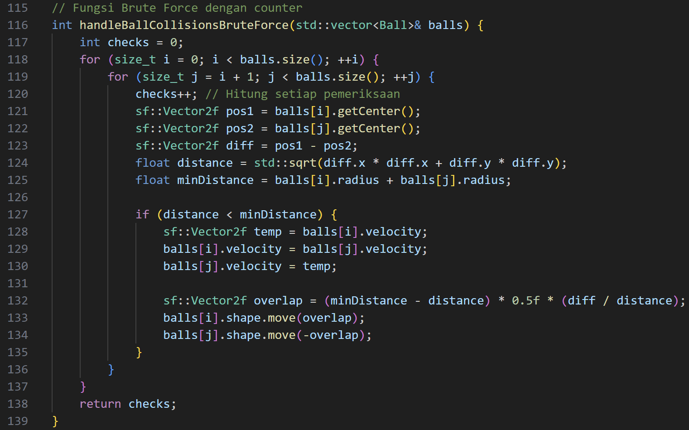
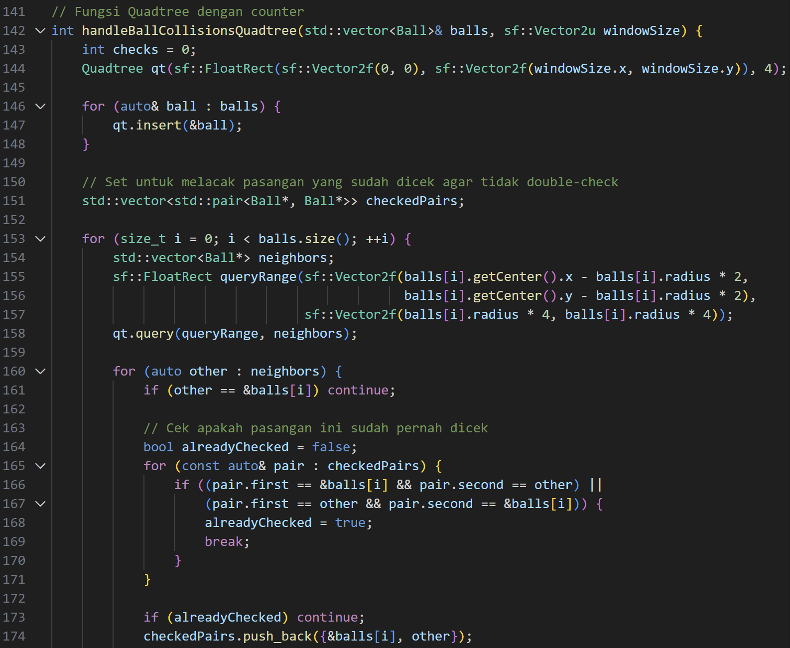
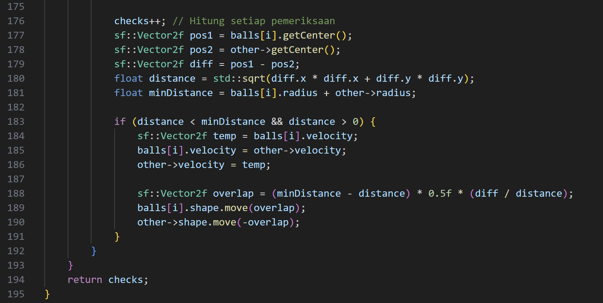

# FINAL PROJECT STRUKTUR DATA DAN ALGORITMA

## Deskripsi
Program simulasi ini mendeteksi collision antar bola 2D menggunakan C++ dan library SFML. 

Tujuan pokoknya adalah membandingkan seberapa cepat algoritma Brute Force dan QuadTree bekerja saat mendeteksi collision. 

Hasilnya ditampilkan langsung di layar, menunjukkan berapa kali pengecekan dilakukan dan berapa lama waktu yang dibutuhkan setiap algoritma.

---

## Algoritma
### 1. Brute Force
- Kompleksitas: O(n²)
- Cara Kerja: Memeriksa setiap pasangan bola
- Keunggulan: Sederhana dan mudah dipahami
- Kelemahan: Lambat untuk jumlah objek besar

Code dari algoritma Brute Force:

### 2. QuadTree
- Kompleksitas: O(n $log$ n)
- Cara Kerja: Partisi ruang hierarkis untuk optimasi pencarian
- Keunggulan: Sangat efisien untuk banyak objek
- Kelemahan: Overhead memori dan implementasi kompleks

Code dari algoritma QuadTree:

---

## Fitur Program
### Fitur Utama
- Simulasi bola 2D
- Deteksi tabrakan antar bola
- Pantulan bola terhadap batas window
- Perbandingan dua metode deteksi tabrakan

### Informasi yang Ditampilkan
- Mode algoritma yang digunakan
- Jumlah bola dalam simulasi
- Jumlah tabrakan yang terdeteksi
- Waktu eksekusi algoritma
- Frames per detik

### Kontrol Program
| Input | Fungsi |
|------|-------|
| Tombol C Keyboard | Mengganti mode Brute Force / QuadTree |
| Panah Atas | Menambahkan 10 bola baru |
| Panah Bawah | Mengurangi 10 bola |
| Tutup window | Mengakhiri program |

---

## Tujuan Pembelajaran
- Memahami konsep collision detection
- Membandingkan kompleksitas algoritma Brute Force dan QuadTree
- Menerapkan struktur data QuadTree pada simulasi grafis
- Mengamati pengaruh optimasi algoritma terhadap performa program

---

## Tampilan Output Code

https://github.com/user-attachments/assets/c9368755-e7b3-47ee-90bf-110c46bd0cca
